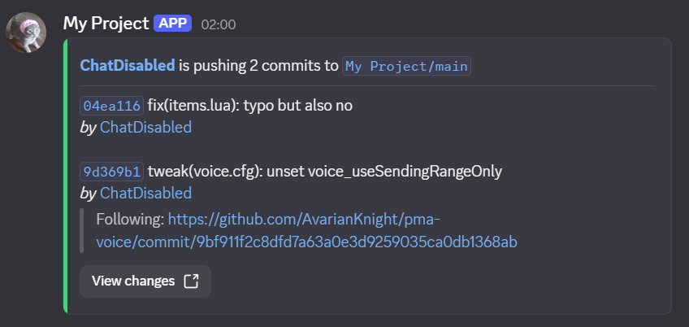
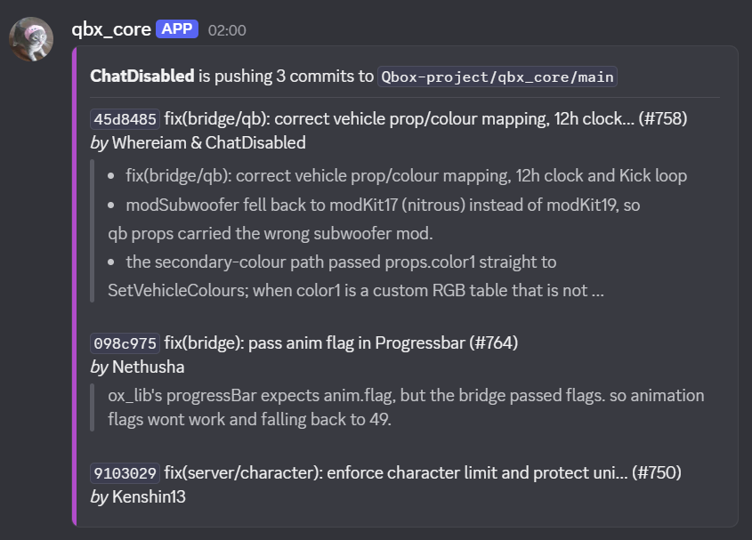
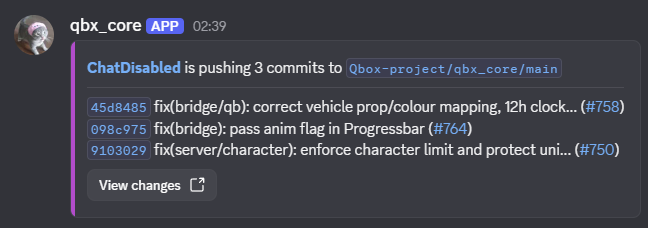
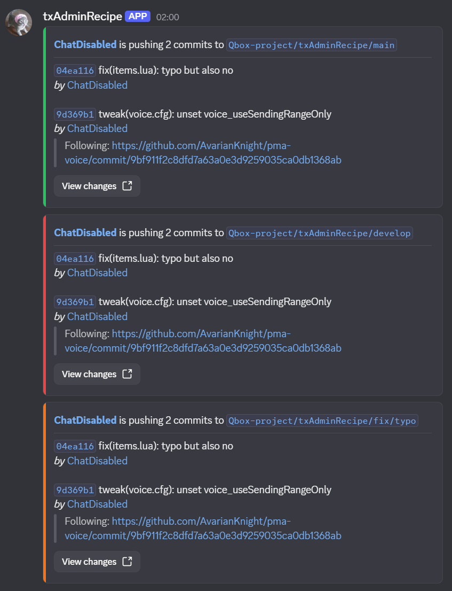

# Pipeline Pling

Clear, customizable Discord notifications for every GitHub push.

Pipeline Pling turns a push into a readable Discord message with the sender, branch, commits, authors, co-authors, and links back to GitHub. It uses Discord Components V2, supports per-branch styling, and includes privacy controls for teams that need them.


## Why Pipeline Pling?

- **Readable at a glance:** See who pushed, where they pushed, and what changed without opening GitHub.
- **Useful links:** Jump directly to branches, commits, pull requests, contributor profiles, or the full comparison.
- **Flexible delivery:** Filter branches, skip bot pushes, post into forum threads, or silence individual commits.
- **Custom appearance:** Use repository names, sender avatars, custom names, and branch-specific accent colors.
- **Privacy controls:** Hide links, anonymize names, or fully redact selected commits and contributors.
- **Reliable failures:** Retry a Discord rate limit once and surface clear errors for rejected webhook requests.

## Quick start

### 1. Create a Discord webhook

In Discord, open **Server Settings → Integrations → Webhooks**, create a webhook for the channel that should receive notifications, and copy its URL. See [Discord's webhook guide](https://support.discord.com/hc/en-us/articles/228383668-Intro-to-Webhooks) if you need help.

Use the webhook URL exactly as Discord provides it. Do not add `/github`; that suffix is only for Discord's built-in GitHub integration.

### 2. Save the webhook as a GitHub secret

In your GitHub repository, open **Settings → Secrets and variables → Actions**, create a repository secret named `DISCORD_WEBHOOK_URL`, and paste in the webhook URL.

### 3. Add the workflow

Create `.github/workflows/discord-push.yml` in the repository you want to watch:

```yaml
name: Discord push notifications

on:
  push:

permissions: {}

jobs:
  notify-discord:
    runs-on: ubuntu-latest
    steps:
      - name: Notify Discord
        uses: Qbox-project/pipeline-pling@v1.3
        with:
          webhook-url: ${{ secrets.DISCORD_WEBHOOK_URL }}
```

That is all the action needs. You do not need to check out the repository, grant `GITHUB_TOKEN` permissions, define environment variables, or handle action outputs.

## Configuration

All inputs are optional unless marked as required.

### Essentials

| Input         | Required | Default | Description                                                                     |
| ------------- | -------- | ------- | ------------------------------------------------------------------------------- |
| `webhook-url` | Yes      | —       | Discord webhook URL used to send the notification. Store it as a GitHub secret. |
| `thread-id`   | No       | —       | Discord forum thread ID to post into.                                           |

### Filtering

| Input              | Required | Default   | Description                                                                       |
| ------------------ | -------- | --------- | --------------------------------------------------------------------------------- |
| `skip-bots`        | No       | `true`    | Skip pushes made by bot accounts.                                                 |
| `silent-keyword`   | No       | `!silent` | Omit a commit when this is the first non-empty line of its commit body.           |
| `branch-allowlist` | No       | —         | Comma-separated branch names to include. Names use case-sensitive exact matching. |
| `branch-denylist`  | No       | —         | Comma-separated branch names to exclude. Names use case-sensitive exact matching. |

When both branch lists are set, a branch must appear in the allowlist and not appear in the denylist. Empty lists are ignored.

### Appearance

| Input               | Required | Default          | Description                                                                                                      |
| ------------------- | -------- | ---------------- | ---------------------------------------------------------------------------------------------------------------- |
| `accent-color`      | No       | Repository color | Accent color as `#RRGGBB` or `RRGGBB`. Invalid values fall back to a color derived from the repository name.     |
| `branch-colors`     | No       | —                | Per-branch colors as `pattern=#RRGGBB` entries separated by commas or newlines. The first matching pattern wins. |
| `use-sender-avatar` | No       | `true`           | Use the push sender's GitHub avatar as the webhook avatar.                                                       |
| `use-repo-username` | No       | `true`           | Use the repository name as the webhook username.                                                                 |
| `repo-name`         | No       | Repository name  | Override the repository label and webhook username, up to Discord's 80-character limit.                          |
| `hide-links`        | No       | `false`          | Remove actor, branch, commit, pull request, and profile links, plus the **View changes** button.                 |
| `compact-mode`      | No       | `false`          | Display commits on consecutive lines with their SHA and title, without descriptions or authors.                 |

Branch color patterns are case-sensitive. `*` matches one path segment, while `**` can match across segments. A matching `branch-colors` rule takes priority over `accent-color`.

### Privacy

| Input             | Required | Default | Description                                                                                                |
| ----------------- | -------- | ------- | ---------------------------------------------------------------------------------------------------------- |
| `anon-keyword`    | No       | `!anon` | Fully redact a commit when this is the first non-empty line of its commit body.                            |
| `name-anon-users` | No       | —       | Comma-separated GitHub usernames whose names are shown as `Anonymous` while commit details remain visible. |
| `full-anon-users` | No       | —       | Comma-separated GitHub usernames whose authored or co-authored commits are fully redacted.                 |

Username matching is case-insensitive and ignores empty entries.

## Common recipes

### Post into a Discord forum thread

Store the thread ID as a GitHub Actions variable and pass it alongside the webhook:

```yaml
with:
  webhook-url: ${{ secrets.DISCORD_WEBHOOK_URL }}
  thread-id: ${{ vars.DISCORD_THREAD_ID }}
```

### Filter and color branches

Only notify for `main`, `develop`, and two selected fix branches, while giving each branch family its own color:

```yaml
with:
  webhook-url: ${{ secrets.DISCORD_WEBHOOK_URL }}
  branch-allowlist: main,develop,fix/login,fix/inventory
  branch-colors: |
    main=#22c55e
    develop=#ef4444
    fix/*=#f97316
```

The allowlist uses exact branch names; only `branch-colors` supports glob patterns.

### Customize the notification identity

```yaml
with:
  webhook-url: ${{ secrets.DISCORD_WEBHOOK_URL }}
  repo-name: My Project
  accent-color: "#F1E542"
```

To keep the name or avatar configured on the Discord webhook instead, disable either override:

```yaml
with:
  webhook-url: ${{ secrets.DISCORD_WEBHOOK_URL }}
  use-repo-username: false
  use-sender-avatar: false
```

### Silence a commit

Put `!silent` on the first non-empty line after the commit title:

```text
chore(deps): update the lockfile

!silent
```

The commit is left out of the Discord message. If every commit in a push is silent, no webhook is sent.

### Anonymize a commit or contributor

Use `!anon` in the same position to fully redact one commit:

```text
fix(items.lua): correct an internal issue

!anon
```

You can also configure privacy rules by GitHub username:

```yaml
with:
  webhook-url: ${{ secrets.DISCORD_WEBHOOK_URL }}
  name-anon-users: alice,bob
  full-anon-users: sensitive-contributor
```

- `name-anon-users` replaces matching sender, author, and co-author names with `Anonymous`, but leaves the commit visible.
- `full-anon-users` fully redacts commits authored or co-authored by a matching user.
- If the push sender is on either anonymity list, their profile link is removed and an anonymous avatar is used when sender avatars are enabled.
- If any commit is fully anonymous, branch and comparison links are removed so the notification cannot reveal the redacted commit indirectly.
- A commit that is both silent and anonymous is omitted; silence takes precedence.

### Hide every GitHub link

```yaml
with:
  webhook-url: ${{ secrets.DISCORD_WEBHOOK_URL }}
  hide-links: true
```

The notification keeps its text while removing all hyperlinks and the **View changes** button.

### Condense commit lists

Use compact mode to put each SHA-and-title entry on its own consecutive line and omit commit descriptions and author attribution:

```yaml
with:
  webhook-url: ${{ secrets.DISCORD_WEBHOOK_URL }}
  compact-mode: true
```

Compact mode includes every commit that fits within Discord's message limit; if the list is too long, the notification shows how many additional commits were omitted.

## More examples

<table>
  <tr>
    <td align="center">
      <strong>Co-authored commits</strong><br>
      
    </td>
    <td align="center">
      <strong>Keyword anonymization</strong><br>
      
    </td>
  </tr>
  <tr>
    <td align="center">
      <strong>Name anonymization</strong><br>
      
    </td>
    <td align="center">
      <strong>Full anonymization</strong><br>
      
    </td>
  </tr>
  <tr>
    <td align="center">
      <strong>Custom repository name</strong><br>
      
    </td>
    <td align="center">
      <strong>Links hidden</strong><br>
      
    </td>
  </tr>
  <tr>
    <td align="center" colspan="2">
      <strong>Compact commit list</strong><br>
      
    </td>
  </tr>
  <tr>
    <td align="center" colspan="2">
      <strong>Per-branch colors</strong><br>
      
    </td>
  </tr>
</table>

## Security and permissions

Treat the Discord webhook URL like a password. Store it in a GitHub Actions secret, never commit it, and rotate it in Discord if it is exposed.

Pipeline Pling reads the `push` event payload supplied by GitHub and sends the rendered message to your configured Discord webhook. It does not require `GITHUB_TOKEN` permissions or a checked-out copy of your repository.

The `@v1.3` tag in the quick-start example stays on the 1.3 release line. For an immutable dependency, replace `@v1.3` with the full commit SHA for the release you have reviewed. GitHub describes full-length SHA pinning as the most secure way to consume a third-party action in its [secure use guidance](https://docs.github.com/en/actions/reference/security/secure-use#using-third-party-actions).

## Troubleshooting

### The workflow ran, but no message appeared

Check the action log for a skip reason. Pipeline Pling intentionally skips non-push events, empty pushes, bot pushes when `skip-bots` is enabled, branches excluded by your filters, and pushes where every commit is silent.

Branch allowlists and denylists use case-sensitive exact matching. For example, `Develop` does not match `develop`, and `fix/*` is only supported by `branch-colors`, not the branch allowlist.

### Discord rejected the webhook

Copy a fresh webhook URL from Discord and update `DISCORD_WEBHOOK_URL`. Do not append `/github`. A deleted webhook or a webhook copied with the wrong suffix commonly returns a `401` or `404` response.

If Discord rate-limits a request, the action waits for the requested delay, up to 30 seconds, and retries once. A second failure ends the workflow with Discord's response status and message.

### The accent color did not apply

Check the workflow log for a warning. Colors must contain exactly six hexadecimal digits, with an optional leading `#`. Invalid values are ignored, and the action falls back to `accent-color` or the repository-derived color.

## Development

Install dependencies and run the full check locally:

```bash
npm ci
npm run check
```

To exercise the included push fixtures against a real Discord webhook with [`act`](https://github.com/nektos/act), create `.secrets` from `.secrets.example`, add your webhook URL, and run:

```bash
npm run act:test
```

The `.secrets` file is ignored by Git. Never commit a real webhook URL.

The release workflow runs the checks, builds the minified Node.js action bundle, publishes it with the release tag, and updates the floating major tag for that release.

## Support

Found a bug or have an idea? Join the [Qbox Discord](https://discord.gg/Z6Whda5hHA) and share the relevant workflow snippet and action log. Remove webhook URLs and other secrets before posting.

## License

Pipeline Pling is available under the [MIT License](LICENSE).
