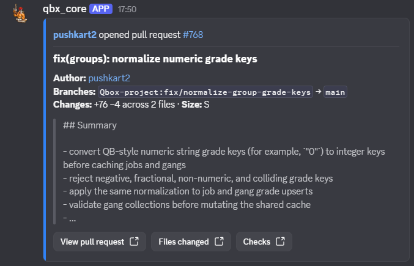
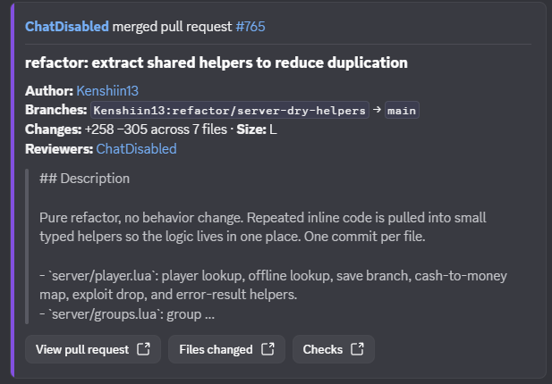
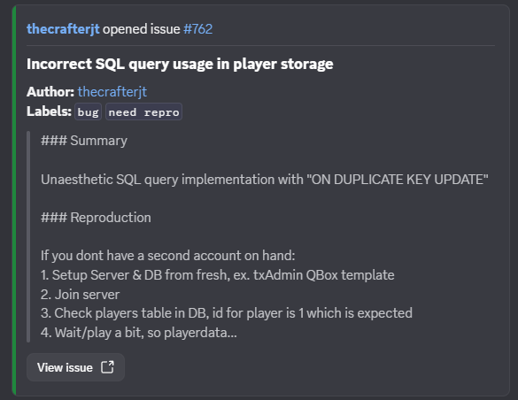
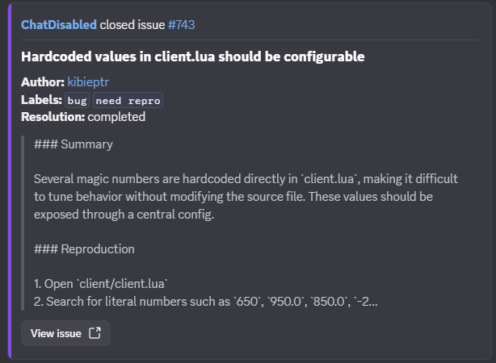
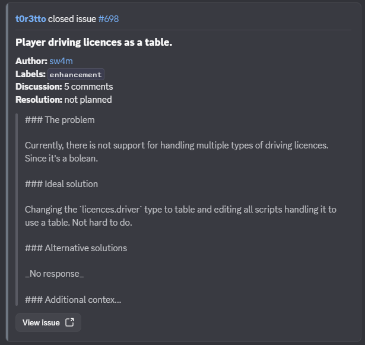
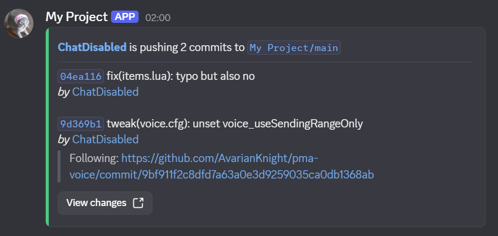
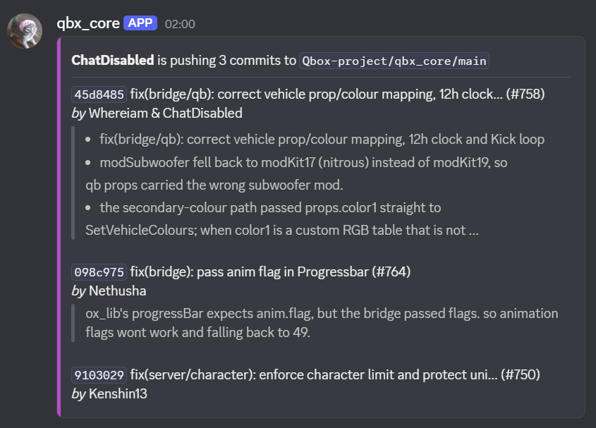
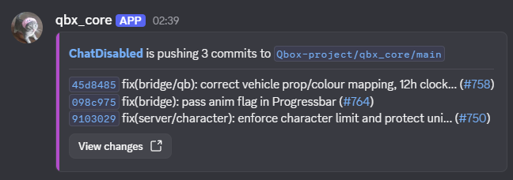
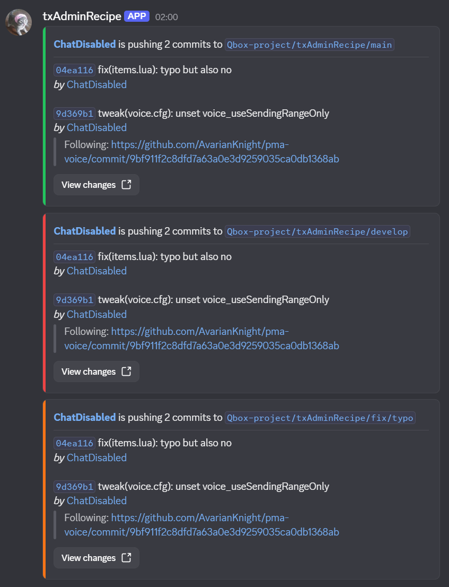

# Pipeline Pling

Clear, customizable Discord notifications for pushes, pull requests, and issues.

Pipeline Pling turns GitHub activity into readable Discord cards. Push cards show commits and contributors, pull request cards show lifecycle state and review context, and issue cards show the information needed for triage. It uses Discord Components V2, needs no checkout or GitHub API token, and includes routing, styling, filtering, and privacy controls.


## Why Pipeline Pling?

- **Readable at a glance:** See what was pushed, opened, merged, reopened, or closed without opening GitHub.
- **Useful links:** Jump directly to branches, commits, pull requests, changed files, checks, issues, or contributor profiles.
- **Flexible delivery:** Filter branches and labels, exclude drafts or bots, and route each activity type to a different webhook or thread.
- **Custom appearance:** Use semantic lifecycle colors, GitHub label colors, repository names, sender avatars, and compact cards.
- **Privacy controls:** Hide links, anonymize names, or fully redact selected commits, contributors, pull requests, and issues.
- **Reliable failures:** Retry a Discord rate limit once and surface clear errors for rejected webhook requests.

## Quick start

### 1. Create a Discord webhook

In Discord, open **Server Settings → Integrations → Webhooks**, create a webhook for the channel that should receive notifications, and copy its URL. See [Discord's webhook guide](https://support.discord.com/hc/en-us/articles/228383668-Intro-to-Webhooks) if you need help.

Use the webhook URL exactly as Discord provides it. Do not add `/github`; that suffix is only for Discord's built-in GitHub integration.

### 2. Save the webhook as a GitHub secret

In your GitHub repository, open **Settings → Secrets and variables → Actions**, create a repository secret named `DISCORD_WEBHOOK_URL`, and paste in the webhook URL.

### 3. Add the workflow

Create `.github/workflows/discord-notifications.yml` in the repository you want to watch:

```yaml
name: Discord notifications

on:
  push:
  pull_request_target:
    types: [opened, reopened, converted_to_draft, ready_for_review, closed]
  issues:
    types: [opened, reopened, closed]

permissions: {}

jobs:
  notify-discord:
    runs-on: ubuntu-latest
    steps:
      - name: Notify Discord
        uses: Qbox-project/pipeline-pling@v1
        with:
          webhook-url: ${{ secrets.DISCORD_WEBHOOK_URL }}
```

That is all the action needs. Do not add a checkout step to this notification job. You do not need `GITHUB_TOKEN` permissions, repository code, environment variables, or action outputs.

`pull_request_target` is used so the Discord webhook secret remains available for pull requests from forks and notifications still run for conflicted pull requests. It is safe here because this job only reads GitHub's event payload and runs the published Pipeline Pling action; it must never checkout or execute the pull request's code. If you only want notifications for trusted, same-repository branches, you can use `pull_request` instead.

## Configuration

All inputs are optional unless marked as required; `webhook-url` is the only required one. The **Applies to** column shows which events each input affects, since some apply to pushes only and others only to pull request and issue cards.

### Essentials

| Input         | Required | Default | Description                                                                     |
| ------------- | -------- | ------- | ------------------------------------------------------------------------------- |
| `webhook-url` | Yes      | —       | Discord webhook URL used to send the notification. Store it as a GitHub secret. |
| `thread-id`   | No       | —       | Discord forum thread ID to post into.                                           |
| `pull-request-webhook-url` | No | `webhook-url` | Webhook override for pull request cards. |
| `pull-request-thread-id` | No | `thread-id` | Thread override for pull request cards. |
| `issue-webhook-url` | No | `webhook-url` | Webhook override for issue cards. |
| `issue-thread-id` | No | `thread-id` | Thread override for issue cards. |

### Filtering

| Input              | Applies to | Default   | Description                                                                       |
| ------------------ | ---------- | --------- | --------------------------------------------------------------------------------- |
| `skip-bots`        | All events | `true`    | Skip activity performed by bot accounts.                                          |
| `silent-keyword`   | Pushes     | `!silent` | Omit a commit when this is the first non-empty line of its commit body.           |
| `branch-allowlist` | Pushes     | —         | Comma-separated branch names to include. Names use case-sensitive exact matching. |
| `branch-denylist`  | Pushes     | —         | Comma-separated branch names to exclude. Names use case-sensitive exact matching. |

When both branch lists are set, a branch must appear in the allowlist and not appear in the denylist. Empty lists are ignored.

The branch lists filter **pushes only**; they never suppress a pull request or issue card. To restrict pull requests by branch, use `pull-request-base-allowlist` and `pull-request-head-allowlist` below. Issues have no branch, so they can only be filtered by label.

### Pull request and issue filtering

| Input | Default | Description |
| ----- | ------- | ----------- |
| `pull-request-actions` | `opened,reopened,converted_to_draft,ready_for_review,closed` | Enabled PR lifecycle actions. Add `synchronize` to notify for every new head commit. A `closed` event is rendered as merged or closed depending on whether the PR was merged. |
| `issue-actions` | `opened,reopened,closed` | Enabled issue lifecycle actions. |
| `pull-request-drafts` | `include` | Use `exclude` to suppress cards while a PR is still a draft; its `ready_for_review` transition remains eligible. |
| `pull-request-base-allowlist` / `pull-request-base-denylist` | — | Target branch patterns to include or exclude. |
| `pull-request-head-allowlist` / `pull-request-head-denylist` | — | Source branch patterns to include or exclude; fork-qualified values such as `contributor:feature/**` are supported. |
| `pull-request-label-allowlist` / `pull-request-label-denylist` | — | Require any allowlisted label or reject any denylisted label. |
| `issue-label-allowlist` / `issue-label-denylist` | — | Equivalent label filters for issues. |

PR branch patterns are case-sensitive. `*` matches one path segment and `**` matches across segments. Label matching is case-insensitive and exact. Denylists win when both lists match.

### Appearance

| Input               | Applies to | Default          | Description                                                                                                      |
| ------------------- | ---------- | ---------------- | ---------------------------------------------------------------------------------------------------------------- |
| `accent-color`      | All events | Event default | Fallback accent as `#RRGGBB` or `RRGGBB`; pushes otherwise use a repository color and activity cards use semantic colors. |
| `branch-colors`     | Pushes     | —                | Per-branch colors as `pattern=#RRGGBB` entries separated by commas or newlines. The first matching pattern wins. |
| `use-sender-avatar` | All events | `true`           | Use the event sender's GitHub avatar as the webhook avatar.                                                      |
| `use-repo-username` | All events | `true`           | Use the repository name as the webhook username. When the resolved name contains `clyde` (case-insensitive), Discord rejects it, so the action omits the username override and Discord keeps the name configured on the webhook. |
| `repo-name`         | All events | Repository name  | Override the repository label and webhook username, up to Discord's 80-character limit. The same `clyde` rejection applies to this override. |
| `hide-links`        | All events | `false`          | Remove generated GitHub links and all action buttons.                                                            |
| `compact-mode`      | All events | `false`          | Condense push commits and omit secondary PR/issue metadata and body excerpts.                                    |
| `pull-request-details` | PRs | `body,labels,reviewers,assignees,stats` | Optional metadata rows on standard PR cards. |
| `issue-details` | Issues | `body,type,labels,assignees,milestone` | Optional metadata rows on standard issue cards. |
| `body-max-length` | PRs, issues | `320` | Maximum PR/issue body excerpt length from `0` to `1000`; `0` hides bodies. Measured before Markdown escaping and quote prefixes are applied. Out-of-range values are clamped. |
| `pull-request-size-thresholds` | PRs | `100,500,1000` | Changed-line thresholds for S, M, L, and XL PR badges. |
| `highlight-first-time-contributors` | PRs, issues | `true` | Show a first-time-contributor badge from GitHub's author association. |
| `event-colors` | PRs, issues | Semantic colors | State colors as `event.action=#RRGGBB`, separated by commas or newlines. |
| `label-color-priority` | PRs, issues | — | Ordered labels whose GitHub color overrides the event color. |

Branch color patterns are case-sensitive. `*` matches one path segment, while `**` can match across segments. A matching `branch-colors` rule takes priority over `accent-color`.

`pull-request-details` and `issue-details` control the optional rows only. PR cards always show **Author** and **Branches**; issue cards always show **Author**, plus **Discussion** and **Resolution** when those apply. Use `compact-mode` to drop the metadata block entirely.

For PRs and issues, color precedence is: first matching `label-color-priority` label, the most specific `event-colors` key, `accent-color`, then the semantic default. Supported keys are `pull-request`, `pull-request.opened`, `pull-request.reopened`, `pull-request.draft`, `pull-request.ready`, `pull-request.merged`, `pull-request.closed`, `pull-request.synchronize`, `issue`, `issue.opened`, `issue.reopened`, `issue.closed`, and `issue.not_planned`. Issues closed as not planned default to grey (`#6e7681`) and fall back to `issue.closed` when only that key is set, so an existing closed-issue color keeps applying to them.

### Privacy

| Input             | Applies to  | Default | Description                                                                                                |
| ----------------- | ----------- | ------- | ---------------------------------------------------------------------------------------------------------- |
| `anon-keyword`    | Pushes      | `!anon` | Fully redact a commit when this is the first non-empty line of its commit body.                            |
| `name-anon-users` | All events  | —       | GitHub usernames shown as `Anonymous` while activity details remain visible.                               |
| `full-anon-users` | All events  | —       | GitHub usernames whose commits, pull requests, or issues are fully redacted.                               |
| `redact-labels`   | PRs, issues | —       | Fully redact a PR or issue carrying any listed label.                                                       |

Username and privacy-label matching is case-insensitive and ignores empty entries. On PRs and issues, `name-anon-users` masks actors and authors while retaining the activity; `full-anon-users` fully redacts items created by a listed user. Label redaction removes the number, title, body, metadata, links, buttons, and label-derived color. GitHub-controlled content can never ping Discord users or roles.

## Common recipes

Unless a recipe shows a full workflow, it is a fragment: merge the `with:` entries into the `with:` block of the Quick start workflow above. A bare `with:` block is not a valid workflow file on its own.

### Choose lifecycle activity

GitHub's `on.<event>.types` decides when a runner starts. The action inputs are a second, defensive filter. Keep both aligned:

```yaml
on:
  push:
  pull_request_target:
    types: [opened, reopened, ready_for_review, closed, synchronize]
  issues:
    types: [opened, reopened, closed]

permissions: {}

jobs:
  notify-discord:
    runs-on: ubuntu-latest
    steps:
      - uses: Qbox-project/pipeline-pling@v1
        with:
          webhook-url: ${{ secrets.DISCORD_WEBHOOK_URL }}
          pull-request-actions: opened,reopened,ready_for_review,closed,synchronize
```

Dropping an event from `on:` disables it entirely, so keep `push:` listed unless you genuinely want no push notifications.

### Route activity to separate Discord destinations

The base webhook and thread remain the fallback for pushes. Overrides can send PRs and issues elsewhere:

```yaml
with:
  webhook-url: ${{ secrets.DISCORD_PUSH_WEBHOOK_URL }}
  pull-request-webhook-url: ${{ secrets.DISCORD_PR_WEBHOOK_URL }}
  issue-webhook-url: ${{ secrets.DISCORD_ISSUE_WEBHOOK_URL }}
  pull-request-thread-id: ${{ vars.DISCORD_PR_THREAD_ID }}
  issue-thread-id: ${{ vars.DISCORD_ISSUE_THREAD_ID }}
```

### Triage by label and color

Only post externally visible issues, hide sensitive cards, and borrow the highest-priority GitHub label color:

```yaml
with:
  webhook-url: ${{ secrets.DISCORD_WEBHOOK_URL }}
  issue-label-allowlist: public,community
  issue-label-denylist: no-discord
  redact-labels: security,private
  label-color-priority: security,bug,enhancement
  event-colors: |
    pull-request.merged=#8250DF
    pull-request.closed=#CF222E
    issue.opened=#1F883D
```

### Tune activity card density

```yaml
with:
  webhook-url: ${{ secrets.DISCORD_WEBHOOK_URL }}
  body-max-length: 180
  pull-request-details: body,labels,reviewers,stats
  issue-details: body,type,labels,assignees
  pull-request-size-thresholds: 50,250,1000
```

### Post into a Discord forum thread

Store the thread ID as a GitHub Actions variable and pass it alongside the webhook:

```yaml
with:
  webhook-url: ${{ secrets.DISCORD_WEBHOOK_URL }}
  thread-id: ${{ vars.DISCORD_THREAD_ID }}
```

### Filter and color branches

Only notify for **pushes** to `main`, `develop`, and two selected fix branches, while giving each branch family its own color:

```yaml
with:
  webhook-url: ${{ secrets.DISCORD_WEBHOOK_URL }}
  branch-allowlist: main,develop,fix/login,fix/inventory
  branch-colors: |
    main=#22c55e
    develop=#ef4444
    fix/*=#f97316
```

The allowlist uses exact branch names; only `branch-colors` supports glob patterns. Both inputs affect pushes only, so pull request and issue cards keep arriving from every branch. Add `pull-request-base-allowlist` or `pull-request-head-allowlist` if you want the same restriction there.

### Customize the notification identity

```yaml
with:
  webhook-url: ${{ secrets.DISCORD_WEBHOOK_URL }}
  repo-name: My Project
  accent-color: "#F1E542"
```

To keep the name or avatar configured on the Discord webhook instead, disable either override:

```yaml
with:
  webhook-url: ${{ secrets.DISCORD_WEBHOOK_URL }}
  use-repo-username: false
  use-sender-avatar: false
```

Discord rejects webhook usernames that contain `clyde` (matched case-insensitively). If the resolved repository name or `repo-name` override would be rejected, Pipeline Pling omits the `username` field and Discord falls back to the name configured on the webhook itself.

### Silence a commit

Put `!silent` on the first non-empty line after the commit title:

```text
chore(deps): update the lockfile

!silent
```

The commit is left out of the Discord message. If every commit in a push is silent, no webhook is sent.

### Anonymize a commit or contributor

Use `!anon` in the same position to fully redact one commit:

```text
fix(items.lua): correct an internal issue

!anon
```

You can also configure privacy rules by GitHub username:

```yaml
with:
  webhook-url: ${{ secrets.DISCORD_WEBHOOK_URL }}
  name-anon-users: alice,bob
  full-anon-users: sensitive-contributor
```

- `name-anon-users` replaces matching sender, author, and co-author names with `Anonymous`, but leaves the commit visible.
- `full-anon-users` fully redacts commits authored, co-authored, or committed by a matching user.
- If the push sender is on either anonymity list, their profile link is removed and an anonymous avatar is used when sender avatars are enabled.
- If any commit is fully anonymous, branch and comparison links are removed so the notification cannot reveal the redacted commit indirectly.
- A commit that is both silent and anonymous is omitted; silence takes precedence.

### Hide every GitHub link

```yaml
with:
  webhook-url: ${{ secrets.DISCORD_WEBHOOK_URL }}
  hide-links: true
```

The notification keeps its text while removing all hyperlinks and every action button: **View changes** on pushes, **View pull request**, **Files changed** and **Checks** on pull requests, and **View issue** on issues.

### Condense commit lists

Use compact mode to put each SHA-and-title entry on its own consecutive line and omit commit descriptions and author attribution:

```yaml
with:
  webhook-url: ${{ secrets.DISCORD_WEBHOOK_URL }}
  compact-mode: true
```

Compact mode includes every commit that fits within Discord's message limit; if the list is too long, the notification shows how many additional commits were omitted.

## Pull request and issue cards

Each card below is a real notification for public [qbx_core](https://github.com/Qbox-project/qbx_core) activity, so you can open the linked pull request or issue and compare it against what Discord received.

<table>
  <tr>
    <td align="center">
      <strong>Pull request opened</strong><br>
      
    </td>
    <td align="center">
      <strong>Pull request merged</strong><br>
      
    </td>
  </tr>
  <tr>
    <td align="center">
      <strong>Issue opened</strong><br>
      
    </td>
    <td align="center">
      <strong>Issue closed as completed</strong><br>
      
    </td>
  </tr>
  <tr>
    <td align="center" colspan="2">
      <strong>Issue closed as not planned</strong><br>
      
    </td>
  </tr>
</table>

## More examples

<table>
  <tr>
    <td align="center">
      <strong>Co-authored commits</strong><br>
      
    </td>
    <td align="center">
      <strong>Keyword anonymization</strong><br>
      
    </td>
  </tr>
  <tr>
    <td align="center">
      <strong>Name anonymization</strong><br>
      
    </td>
    <td align="center">
      <strong>Full anonymization</strong><br>
      
    </td>
  </tr>
  <tr>
    <td align="center">
      <strong>Custom repository name</strong><br>
      
    </td>
    <td align="center">
      <strong>Links hidden</strong><br>
      
    </td>
  </tr>
  <tr>
    <td align="center" colspan="2">
      <strong>Compact commit list</strong><br>
      
    </td>
  </tr>
  <tr>
    <td align="center" colspan="2">
      <strong>Per-branch colors</strong><br>
      
    </td>
  </tr>
</table>

## Security and permissions

Treat the Discord webhook URL like a password. Store it in a GitHub Actions secret, never commit it, and rotate it in Discord if it is exposed.

Pipeline Pling reads the `push`, `pull_request`, `pull_request_target`, or `issues` payload supplied by GitHub and sends a rendered message to the resolved Discord webhook. It does not call the GitHub API and does not require `GITHUB_TOKEN` permissions or a checked-out copy of your repository.

Use `pull_request_target` only in a notification job that never checks out or executes pull request code. That event runs in the base repository context, which makes the webhook secret available for fork contributions but would make an untrusted checkout dangerous. Keep `permissions: {}` and pin third-party actions according to your security policy.

Titles, bodies, labels, branch names, contributor names, and other payload values are treated as untrusted text and cannot inject structural Discord Markdown. Pipeline Pling's own GitHub links remain interactive, while `allowed_mentions` prevents any payload content from notifying Discord users or roles.

### Choose a version

The quick-start example uses `@v1`, the recommended option for most users. This floating major tag points to the latest compatible release in the v1 series, so your workflow receives non-breaking features, fixes, and security updates automatically. Breaking changes will be released under a new major tag such as `@v2`.

Choose the level of update control that fits your project:

- `Qbox-project/pipeline-pling@v1` — recommended; follows the latest compatible v1 release.
- `Qbox-project/pipeline-pling@v1.5.0` — stays on a specific release until you update it manually.
- `Qbox-project/pipeline-pling@<full-commit-sha>` — pins the exact reviewed build commit and provides the strongest protection against a tag being moved. The SHA must be from a release build commit (the one that includes `dist/index.js`), not a commit from `main`. Resolve one with `git rev-parse v1.5.0`.

GitHub recommends major tags for convenient action versioning and full-length commit SHAs when immutability is required. See GitHub's guidance on [managing custom actions](https://docs.github.com/en/actions/how-tos/create-and-publish-actions/manage-custom-actions) and [secure use of third-party actions](https://docs.github.com/en/actions/reference/security/secure-use#using-third-party-actions).

## Troubleshooting

### The workflow ran, but no message appeared

Check the action log for a skip reason. Pipeline Pling intentionally skips unsupported events, malformed payloads, disabled lifecycle actions, bots when `skip-bots` is enabled, excluded branches or labels, drafts when excluded, empty pushes, and pushes where every commit is silent.

Push branch allowlists and denylists use case-sensitive exact matching. PR base/head filters support the same case-sensitive `*` and `**` patterns as branch colors. Label matching is case-insensitive and exact.

If a PR or issue action never starts a workflow, check the workflow's `on.<event>.types`; action inputs can skip a started run but cannot cause GitHub to start one. The `issues` workflow file must exist on the default branch.

### Discord rejected the webhook

Copy a fresh webhook URL from Discord and update `DISCORD_WEBHOOK_URL`. Do not append `/github`. A deleted webhook or a webhook copied with the wrong suffix commonly returns a `401` or `404` response.

If Discord rejects the request because of the webhook username, check whether the repository name or `repo-name` override contains `clyde`. Pipeline Pling omits the username in that case so Discord can use the name configured on the webhook; set `use-repo-username: false` or choose a different `repo-name` if you need an explicit override.

Webhook requests time out after 15 seconds instead of leaving the job waiting indefinitely. If Discord rate-limits a request, the action waits for the requested delay, up to 30 seconds, and retries once. Transient network errors and Discord `5xx` responses retry once after one second. A second failure ends the workflow with the available error details.

### The accent color did not apply

Check the workflow log for a warning. Colors must contain exactly six hexadecimal digits, with an optional leading `#`. Push colors resolve from `branch-colors`, `accent-color`, then the repository color. Activity colors resolve from prioritized GitHub labels, `event-colors`, `accent-color`, then semantic state colors.

## Development

Install dependencies and run the full check locally:

```bash
npm ci
npm run check
```

To exercise the included push fixtures against a real Discord webhook with [`act`](https://github.com/nektos/act), create `.secrets` from `.secrets.example`, add your webhook URL, and run:

```bash
npm run act:test
```

The `.secrets` file is ignored by Git. Never commit a real webhook URL.

### Releasing

Publish a GitHub release with a tag that exactly matches the version in `package.json`, prefixed with `v` (for example, package version `1.5.0` uses tag `v1.5.0`). The release workflow validates the tag, runs all checks, builds the minified Node.js action bundle, commits the bundle to the release tag, and updates the floating major tag.

This workflow intentionally moves the release tag to the generated build commit after the release is published, so it requires mutable GitHub releases. Before enabling immutable releases, change the process to build `dist/index.js` into the release commit before creating its tag.

## Support

Found a bug or have an idea? Join the [Qbox Discord](https://discord.gg/Z6Whda5hHA) and share the relevant workflow snippet and action log. Remove webhook URLs and other secrets before posting.

## License

Pipeline Pling is available under the [MIT License](LICENSE).
